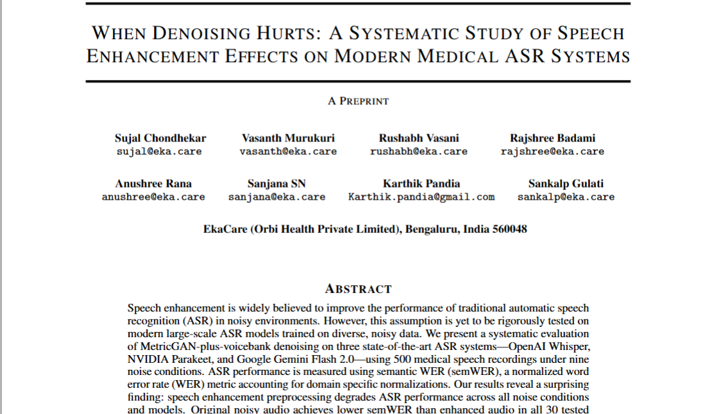

# When Denoising Hurts: A Systematic Study of Speech Enhancement Effects on Modern Medical ASR Systems

> **TL;DR:** Our research reveals that speech enhancement preprocessing **degrades** ASR performance across all modern models and noise conditions. Denoising hurts, it doesn't help!

## 📄 Abstract

Speech enhancement is widely believed to improve the performance of traditional automatic speech recognition (ASR) in noisy environments. However, this assumption is yet to be rigorously tested on modern large-scale ASR models trained on diverse, noisy data. We present a systematic evaluation of MetricGAN-plus-voicebank denoising on four state-of-the-art ASR systems—OpenAI Whisper, NVIDIA Parakeet, Google Gemini Flash 2.0, and Parrotlet-a-en-5b using 500 medical speech recordings under nine noise conditions. 

**Our surprising finding:** Speech enhancement preprocessing degrades ASR performance across all noise conditions and models. Original noisy audio achieves lower semantic WER than enhanced audio in all 30 tested configurations, with degradations ranging from 1.1% to 46.6% absolute semWER increase.

## 🔗 Quick Links

- **Paper:** [arXiv Preprint](https://arxiv.org/abs/2512.17562)
- **Dataset:** [Denoising Impact Evaluation Dataset](https://huggingface.co/datasets/ekacare/denoising-impact-evaluation-dataset)
- **Evaluation Kit:** [KARMA OpenMedEvalKit](https://github.com/eka-care/KARMA-OpenMedEvalKit)

##  Dataset Pipeline

### Source Data
Our evaluation builds upon the **[Eka Medical ASR Evaluation Dataset](https://huggingface.co/datasets/ekacare/eka-medical-asr-evaluation-dataset)**, containing 3,900+ curated medical audio recordings with clinical terminology specific to Indian healthcare contexts.

### Noise Augmentation
We used **[Audiomentations](https://github.com/iver56/audiomentations)** to synthetically add three noise types at varying intensities:
- **Background Noise** (Hospital ambient sounds): SNR 10, 30, 50 dB
- **Short Burst Noise** (Equipment beeps, door slams): SNR 10, 30, 50 dB  
- **Gaussian Noise** (Electronic interference): Amplitudes 0.001, 0.009, 0.017

### Denoising Process
All audio was processed using **[SpeechBrain's SpectralMaskEnhancement](https://huggingface.co/speechbrain/metricgan-plus-voicebank)** with the pre-trained MetricGAN-plus-voicebank model.

### Final Dataset
The comprehensive **[Denoising Impact Evaluation Dataset](https://huggingface.co/datasets/ekacare/denoising-impact-evaluation-dataset)** contains 20 subsets:
- 9 noisy variants + 9 denoised counterparts
- Original clean audio + enhanced-original
- **Total:** 10,000 audio files per ASR system

## Methodology

### ASR Models Evaluated
- **OpenAI Whisper Large-v3**
- **NVIDIA Parakeet-TDT-1.1B**
- **Google Gemini Flash 2.0**
- **Parrotlet-a-en-5b**

### Evaluation Protocol
- **40,000 total transcriptions** (4 models × 10,000 transcriptions each)
- Dual transcription: Noisy audio + Enhanced audio for each condition
- Evaluation using **[KARMA OpenMedEvalKit](https://github.com/eka-care/KARMA-OpenMedEvalKit)**
- Metrics: Semantic WER (semWER)

## Key Findings

###  Universal Performance Degradation
| Model | Background Noise | Short Noise | Gaussian Noise |
|-------|------------------|-------------|----------------|
| **Whisper** | +3.2% to +17.0% | +3.2% to +9.6% | +11.6% to +34.9% |
| **Parakeet** | +1.4% to +5.9% | +1.3% to +3.2% | +2.5% to +11.9% |
| **Gemini** | +1.1% to +4.9% | +1.9% to +3.1% | +3.3% to +46.5% |
| **Parrotlet** | +2.5% to +5.0% | +1.8% to +3.4% | +3.4% to +14.7% |

*Table: ΔsemWER increase after denoising (positive = degradation)*

**Key Insight:** Modern ASR models possess sufficient internal noise robustness. Traditional enhancement removes acoustic features.
### Citation
@article{chondhekar2025denoising,

  title={When Denoising Hurts: A Systematic Study of Speech Enhancement Effects on Modern Medical ASR Systems},
  
  author={Chondhekar Sujal, Rana Anushree, Murukuri Vasanth , SN Sanjana, Vasani Rushabh, Pandia Karthik, Badami Rajshree, Katiyar Sulabh, and Gulati Sankalp},
  
  journal={arXiv preprint},
  
  year={2025},
  
  note={Preprint}
}

